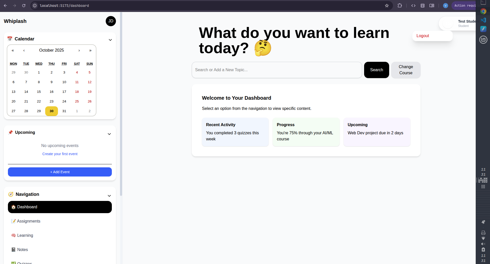
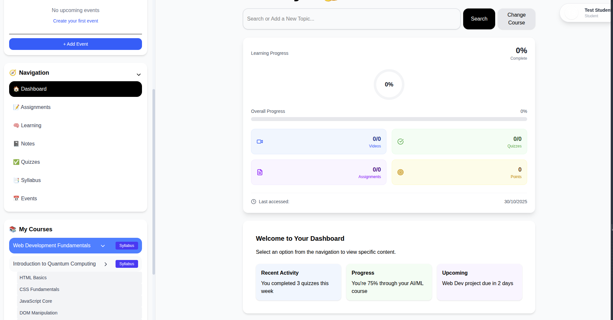
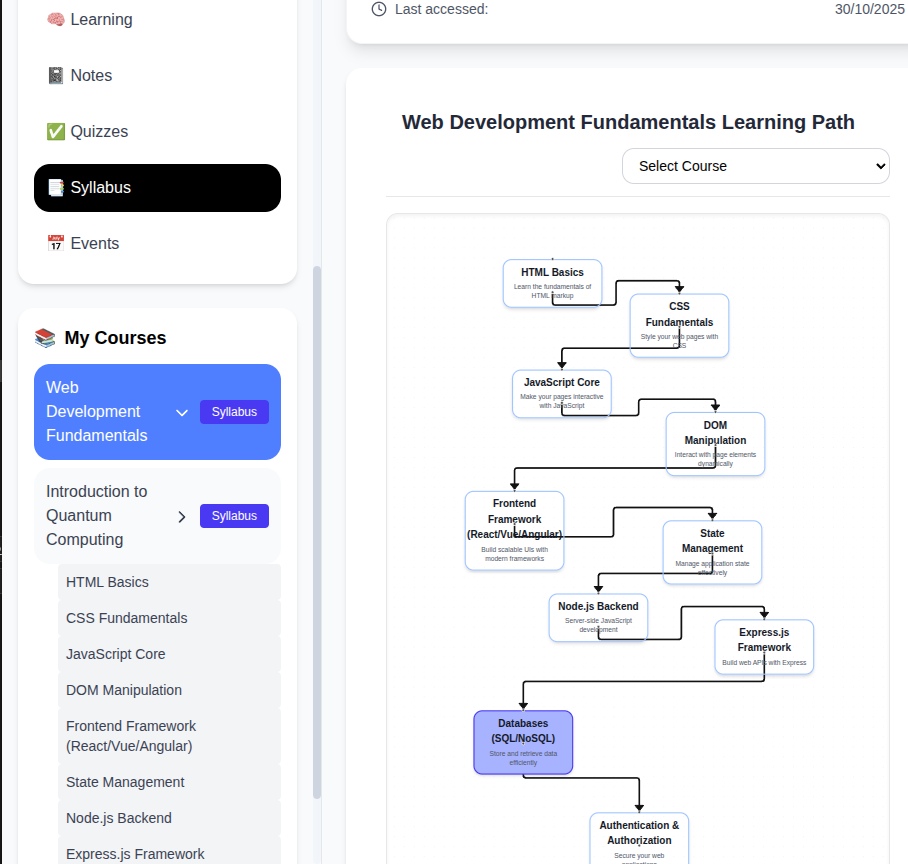
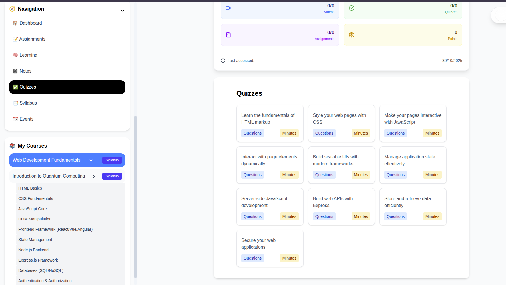
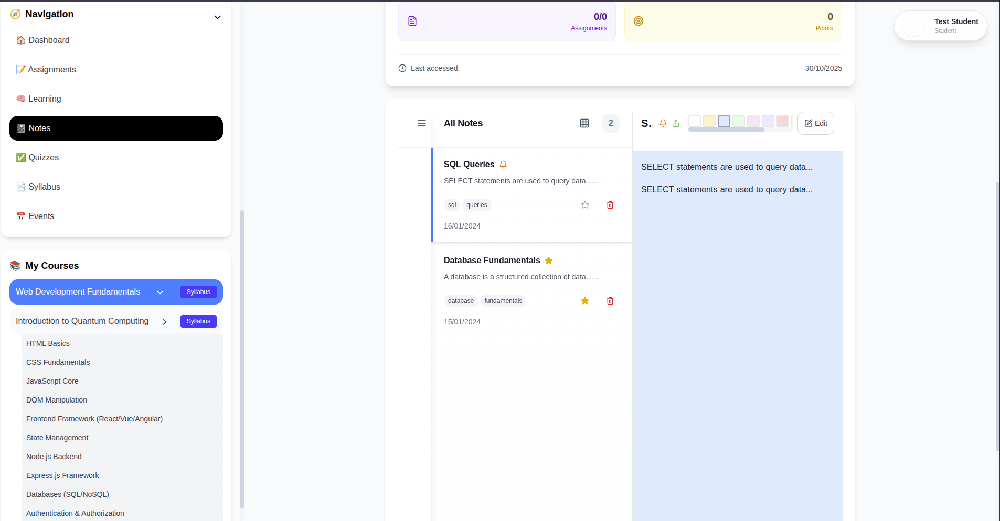

# Whiplash2025
**AI-Powered Learning Management System**

A gamified learning platform that combines the structured roadmap approach of Roadmap.sh with Duolingo-style engagement. Build personalized learning paths, track progress with streaks, and leverage AI to generate study materials, quizzes, and curated video content.

## What It Does
- Create custom learning roadmaps for any topic
- AI-generated study materials and quizzes (powered by Gemini)
- Curated video recommendations from YouTube
- Duolingo-inspired streaks and gamification
- Real-time chat and collaboration
- Progress tracking with visual dashboards

## Tech Stack
- **Frontend**: React 18, Vite, TailwindCSS, Socket.IO
- **Backend**: Node.js, Express, MongoDB, JWT Auth
- **Microservices**: Python Flask (Material Generator, Quiz Generator, Video Fetcher)
- **AI**: Google Gemini API

## Quick Start
```bash
# Backend (port 5000)
cd Backend && npm start

# Frontend (port 5173)
cd Frontend/web-app-frontend && npm run dev
```

**Default Login**: `admin@whiplash.edu` / `admin123`


UI 
DashBoard -> 

Learning Dashboard ->

Learning Pathway Genration ->

Auto Generated Quiz ->

Latex Notes Editor ->

